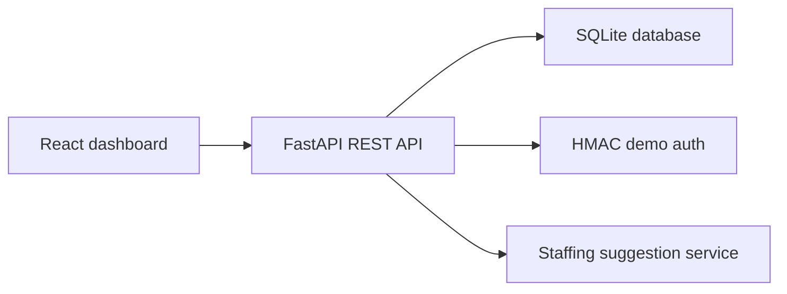

# MasjidFlow Ops

MasjidFlow Ops is a full-stack operations dashboard for masjid and MSA events. It helps organizers see event health, RSVP counts, volunteer shift coverage, and staffing suggestions from one place.

The app is built as a realistic portfolio project: React/TypeScript frontend, FastAPI backend, SQLite database, demo auth, tests, CI, Docker scaffolding, and sample data.

## Demo

Screenshot placeholders:

- `docs/screenshots/dashboard.png` - event operations dashboard.
- `docs/screenshots/coverage.png` - volunteer shift coverage view.
- `docs/screenshots/suggestions.png` - staffing recommendation response.

Demo login:

- Email: `admin@masjidflow.local`
- Password: `demo-admin`

## Architecture



## Local Setup

Backend:

```bash
cd backend
cp .env.example .env
python -m venv .venv
source .venv/bin/activate
pip install -e ".[dev]"
pytest
uvicorn app.main:app --reload --port 8001
```

Frontend:

```bash
cd frontend
cp .env.example .env
npm install
npm run build
npm run dev
```

The frontend expects the backend at `http://127.0.0.1:8001` by default.

## API Routes

- `GET /health`
- `POST /auth/login`
- `GET /events`
- `GET /events/{event_id}`
- `GET /events/{event_id}/coverage`
- `POST /events/{event_id}/suggestions`
- `GET /volunteers`

## Database Design

- `users`: demo admin login and role.
- `events`: event name, date, location, expected attendance, status.
- `volunteers`: contact records for recurring volunteers.
- `volunteer_skills`: many-to-one skills for matching people to shifts.
- `shifts`: event staffing needs by time block and required skill.
- `shift_assignments`: volunteers assigned to shifts.
- `rsvps`: attendee RSVP records.

## Docker

Docker is included for deployment-ready structure:

```bash
docker compose up --build
```

## Deployment Plan

- Backend: Render, Fly.io, Railway, or a small VPS container.
- Frontend: Netlify, Vercel, or static hosting.
- Database: SQLite for demo deployments; Postgres is the natural production upgrade.

## CI Template

The GitHub Actions workflow template is included at `docs/github-actions/ci.yml`. Move it to `.github/workflows/ci.yml` after authenticating GitHub CLI with the `workflow` scope.

## Roadmap

- Volunteer self-service RSVP and shift signup.
- Email/SMS reminders.
- Role-based permissions for admin, organizer, and volunteer users.
- Calendar export and recurring event templates.
- Optional OpenAI planner that explains tradeoffs in the staffing recommendations.

## Recruiter Notes

This project demonstrates full-stack product execution, REST API design, auth, relational data modeling, React state management, deployment scaffolding, tests, and a real workflow from community operations.
